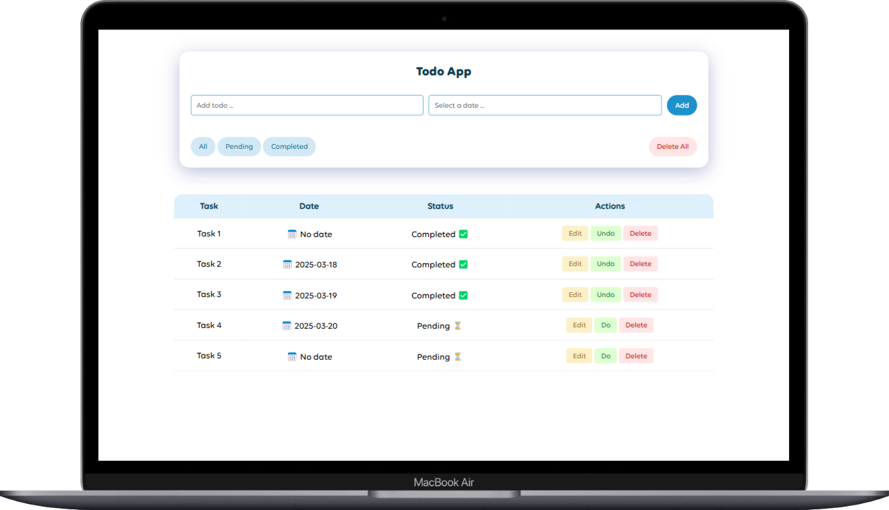
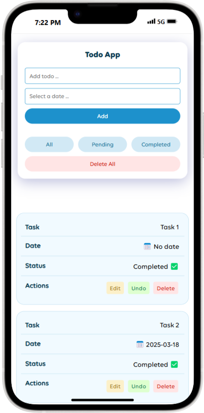

# 📝 Todo App

This is a simple and responsive Todo App built with HTML, CSS, and JavaScript. It allows users to add, edit, delete, and filter tasks. The app uses **localStorage** to save todos persistently in the browser.

## ✨ Features
- Add new todos with a task description and an optional due date.
- Edit existing todos.
- Delete individual todos or clear all todos at once.
- Mark todos as completed or pending.
- Filter todos based on their status (All, Pending, Completed).
- Alerts to show success or error messages.
- Responsive design for both desktop and mobile devices.
- Data persistence using browser's **localStorage**.

## 🛠️ Technologies Used
- **HTML5** for the structure
- **CSS3** for styling and responsiveness
- **JavaScript** for interactivity and logic

## 🚀 How to Use
1. Clone the repository:
```bash
 git clone https://github.com/rezasalimi01/JS-Todo-App
```
2. Navigate to the project directory:
```bash
 cd todo-app
```
3. Open the `index.html` file in your preferred browser.

## 📸 Screenshots
<div style="display: flex; justify-content: center; align-items: center; gap: 10px;">
  
  
</div>

## 🔮 Future Improvements
- Add a search feature to quickly find specific todos.
- Implement a category or tag system for better organization.
- Integrate a backend to sync todos across devices.

## 📄 License
This project is licensed under the MIT License.

---
If you have any questions or feedback, feel free to reach out! 💬

